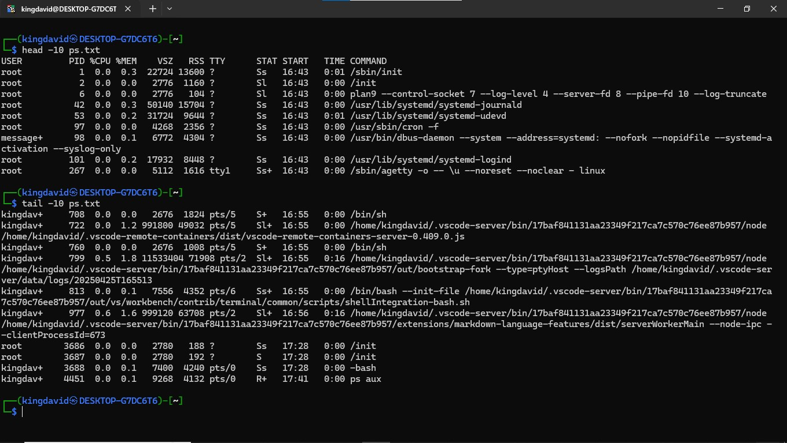

## Day 2: Manipulating Texts

### Participant Details
__Name:__ David Oyewole  
__Date and Time:__ 2025-04-25 19:11 GMT +1

### Task Completed:
- Created and Manipulated some text files using several commands
- Used `cat`, `more`, `less`, `head`, `tail`, `sort`, `wc` e.t.c
- Used `grep` and | on files and used > to direct output into a file
- 
- 
- 
- 
- 
- 
- 

### Additional Notes
Although i am familiar with all the commands, This challenge was still very useful for me to relearn somethings
